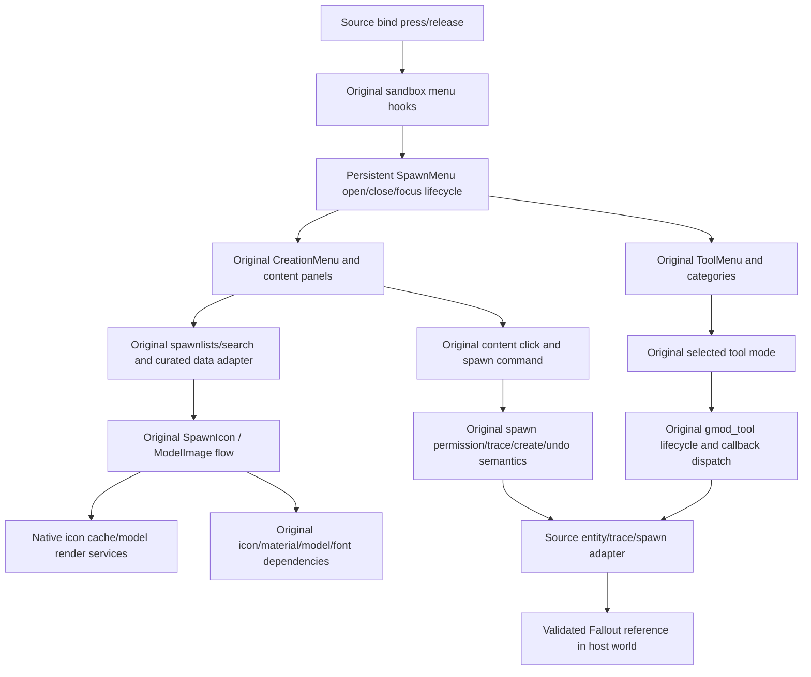

# Required original GMOD system architecture — 2026-10-07

## Evidence basis

Use the installed game as the original-system authority and `bertjerk660-dotcom/REM1` as project history/state authority. The individual source reports retain exact paths, lines, hashes and native build limits. This synthesis describes the required relationships; it does not replace those evidence records with a claim of completed runtime integration.

The source game is assembled from executable/native modules, original Lua gamemode and library modules, native VGUI/Source services, original resource/font definitions, and loose/VPK/addon content. Loading one Lua file or copying a weapon model cannot supply this assembly by itself. Inventory and staging are intentionally different operations: the installation/package index is broad; copied payloads are restricted to the measured subsystem closure and verified prior staging reuse.

## First vertical slice: menu input to spawned reference

The original sandbox creates its menu after the gamemode's entity/weapon definitions have loaded. It constructs a persistent `SpawnMenu` panel with a horizontal divider, `CreationMenu` and `ToolMenu`; the context menu is also created in this lifecycle. Opening restores cursor position, closes the competing context menu, makes the panel a popup, enables mouse input and initially leaves keyboard capture off. Closing disables input/hides the panel and remembers the cursor, except for deliberate text-focus/hang-open behavior. Menu reload/language-refresh paths are distinct from an ordinary open.

Content types, creation tabs, tool tabs/categories and tools are populated by original registries/hooks. Prop content uses original model/icon/cache services and dispatches original spawn commands. The FNV adapter should replace only the world operation and native-host service contracts needed for a Source operation to reach a Fallout reference. The curated project catalog changes available content data; it does not authorize replacing menu behavior or generating imitation chrome/assets.

See [QMENU_ARCHITECTURE.md](QMENU_ARCHITECTURE.md) for the complete trace, hierarchy, search, click/hover/selection, spawnlists, icon/model previews, assets and required native services.

## Second vertical slice: real Q-selected tool to Tool Gun action

Q-menu tool state must select an original tool identifier and immediately determine the Tool Gun's active tool. The SWEP and original tool base/registry establish each tool's owner/state, convars, lifecycle and callbacks. Firing obtains the original trace/result contract, respects realm/prediction/permission conditions, invokes the selected callback, and emits original animation/sound/tracer feedback according to that callback's return behavior.

Duplicator is an entity/constraint serialization and paste system with ownership, undo/cleanup and progress dependencies. Remover validates the trace/target and removes through the original tool behavior. Camera stool/entity and the `gmod_camera` weapon are separate identities with separate creation and presentation behavior. They must not be flattened into a Fallout dialogue selector or unrelated camera screenshot routine.

Tool screens require original render-target/material/font behavior, not only a static model conversion. The source model package includes animation/component/material dependencies that must be tracked before first/third/world presentation is considered complete. Original Source sound event names must resolve to their original definitions and payloads.

See [TOOLGUN_ARCHITECTURE.md](TOOLGUN_ARCHITECTURE.md) for the exact selection chain, firing/prediction/network traces, stool registry, Duplicator/Remover/camera/constraint dependencies and original presentation resources.

## Third vertical slice: Physgun interaction and feedback

The Physics Gun is predominantly native behavior plus original script hooks and assets. A reliable record separates native weapon/hold-controller input and state from Lua allow/pickup/drop/freeze/beam/halo hooks, and separates both from original materials, models and sound event definitions.

The held state must retain an explicit acquired entity/reference, target-local hit point, physical body/bone and controller state. Its beam endpoint and highlighting follow that state; audio loops must start/stop with the relevant actual transition. A generic crosshair ref and repeatedly teleported object are not evidence of the native controller semantics.

The FNV actor bridge is an adaptation responsibility. It must target the acquired actor's physical/ragdoll representation and keep that identity distinct from the player. The project-requested right-click launch/release mapping is a documented host requirement; native original input behavior must first be proved rather than inferred from entity interaction output names.

The declared first-person model and the actually used native/current-build presentation path need separate evidence. An absent declared package is not permission to replace it with a visually similar model. The native report also audits how strongly the previous Physgun 'evidence complete' claim is supported by actual exports and build hashes.

See [PHYSGUN_ARCHITECTURE.md](PHYSGUN_ARCHITECTURE.md) and [IDA68_NATIVE_REPORT.md](IDA68_NATIVE_REPORT.md) for actual recovered addresses/flow, limits, models, beam/halo/color/audio and unresolved branches.

## Transient UI and shared dependencies

Original notification panels have their own stacking, animation, UID progress state, materials, font metrics and expiry loop. Hints add binding/language lookup, timers and original caller-owned sounds. Death notices use original kill-icon registries, glyph fonts and source event records. Tool HUDs/screens, context menus, cursor behavior, overlays and native crosshair HUD services must retain their original responsibility boundaries.

The required source environment includes the GMOD Lua dialect, Lua/native metatables/values, hook/concommand/cvar/list registries, realms/prediction, panels/skins/layout/focus, surface/render/cam APIs, model-icon services, virtual filesystem/package resolution, entities/traces/physics and audio event playback. Each is classified in [dependency_graph.json](../../manifests/gmod_2026-10-07/dependency_graph.json). The graph covers Q menu, prop browser/icons, Tool Gun/selection, Duplicator/Remover/camera, Physgun/beam/highlighting, notifications, HUD and input.

See [OTHER_OVERLAY_SYSTEMS.md](OTHER_OVERLAY_SYSTEMS.md) for the traced original transient UI and font/HUD paths.

## Current integration and next boundary

The actual Windows source inspected in this pass labels itself v85, with support-patch Combine autogive. Its hashes differ from main's old v81 baseline. It reads Q/F2 with `GetAsyncKeyState` and toggles the current C++ build-menu state on a rising edge. That is a demonstrated input/lifecycle difference from the original menu's command hooks and `spawnmenu_toggle` behavior. Current source and deployed binary are tracked separately; source labels do not prove exactly how a deployed binary was built.

The implementation audit classifies what is authentic evidence/payload, useful compatibility code, placeholder, incomplete or potentially incorrect. It retains hypothesis status for flicker, icons and input/actor/audio defects that require reproduction. No working source/runtime/THUG2 component is replaced on the basis of appearance or a stale note.

See [EXISTING_IMPLEMENTATION_AUDIT.md](EXISTING_IMPLEMENTATION_AUDIT.md), [COMPATIBILITY_MATRIX.md](COMPATIBILITY_MATRIX.md), [INTEGRATION_BOUNDARY.md](INTEGRATION_BOUNDARY.md), and [STAGING_SUMMARY.md](STAGING_SUMMARY.md). Remaining work is explicitly indexed in [unresolved_dependencies.json](../../manifests/gmod_2026-10-07/unresolved_dependencies.json).
