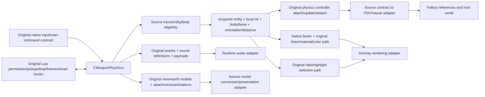

# Original GMOD Physics Gun and host boundary — 2026-10-07

The original Physics Gun combines a native GMOD/Source weapon, Lua gamemode hooks, original weapon/resource definitions, Source physics/render/audio services and mounted model/material payloads. The Source weapon script supplies presentation/event data; it is not a Lua SWEP implementing the entire gun. Source-faithful integration needs that assembly, not a weapon-shaped Fallout effect.

## Authority and current evidence

Canonical histories and prior inventories were checked before further extraction. Installed `sourceengine/scripts/weapon_physgun.txt` is 1,143 bytes, SHA-256 `B5E61291AB5A0296EC6FA48E9E9F8A5712D2C350D3831411D4F3DD61E0BFC354`. `weapon_physcannon.txt` is a **separate weapon**, 1,553 bytes, SHA-256 `F8FC6038845B3484C5D6AC03891AFE13D7934D2DE87DE239AE31062470F9D0D2`. The original Physgun definition names `Weapon_Physgun.On`, `.Off` and `.Special1`; exact source event definitions/payloads and native call sites establish playback semantics, not their names alone.

The installed client/server hashes match the original IDA input copies. The directly inspected IDA 6.8 client export proves native registration `weapon_physgun` → `CWeaponPhysGun`; see [IDA68_NATIVE_REPORT.md](IDA68_NATIVE_REPORT.md). The prior source inventory has five Physgun-hook Lua files but no executable SWEP implementation. Hook paths/callback bodies, native vtable/input flow and renderer/audio calls need separate evidence. The prior “evidence complete” headline exceeded its demonstrated callflow.

## Behavior ownership

Original GMOD acquisition/manipulation and its hooks belong to the GMOD side. FNV reference identity, Havok/ragdoll access and input/render/audio translation belong to the bridge. Fallout remains the host world and normal gameplay owner. Do not infer a complete behavior implementation from one server output name or copy undocumented native regions.

| Operation | Original owner / current evidence | Required completion |
| --- | --- | --- |
| Target trace and eligibility | Native `CWeaponPhysGun`; historical entity/physics interaction strings and Lua allow hooks. | Trace origin/mask/filter, max range/units, eligibility and acquired body/bone must be connected to actual native attack path. |
| Grab/hold | Native held-entity/controller state; prior exports describe grabbed entity, local hit and point controller. | Validate network tables, attach/update/detach, damping and target-local transform algorithm. |
| Rotation/distance | Prior server candidate `0x10104A50–0x10105038`, rotation sensitivity/wheel strings; input contracts unresolved. | Recover user-command flag/axis consumption, clamping and hold-point preservation. |
| Release | Native detachment/drop plus original hook/audio/animation lifecycle. | Prove state cleanup on attack release, invalid target and weapon/cell transitions. |
| Secondary/freeze/reload | Original behavior must be traced independently of project launch requirement. | Label secondary/motion-disable and reload/motion-enable paths and callbacks. |
| Launch/punt | Shared native entity output `OnPhysGunPunt` alone does not prove GMOD gun attack or impulse semantics. | Project launch is an explicit host adaptation until actual native counterpart is proved. |
| Beam | Original physbeam/glow assets, native client rendering and original draw hook. | Connect material/color/attachments/endpoint and hook args to held state. |
| Target highlight | Original Lua/native halo pipeline plus beam/weapon color source. | Recover actual target-selection list, halo color/radius/occlusion and draw timing; do not assume an unconditional outline. |
| Sounds | Original named events and mounted payloads exist in prior support work. | Native start/stop/restart/loop/prediction paths and exact event payloads, separate idle/aim/hold/release. |
| View/world animation | Native weapon model selection, original model animation/attachment data. | Prove actual current-build first-person path and animation sequence/attachment calls. |
| Actors/ragdolls | Native physics targets and Lua permissions differ from live FNV actors. | Source eligibility vs live-NPC/ragdoll behavior; host acquired-actor conversion/restoration is explicit adaptation. |

The latest user requires **LMB interacts/grabs and RMB performs the desired launch/release**. The recovered older support handoff's RMB-grab/LMB-launch mapping is superseded. Original GMOD freeze/drop/reload semantics remain a separate source record. The required project RMB behavior must be implemented as the smallest documented adapter, not claimed to be proved by `OnPhysGunPunt` strings. This investigation changes no runtime controls.

## State and feedback dependency chain

A defensible bridge records a stable acquired reference, source physical body/bone identity, target-local hit point, distance/orientation, controller ownership, actor/ragdoll state and beam/audio state. Required teardown includes input release, weapon unequip, invalid/deleted entity, 3D rebuild, load/cell transition and adapter failure. These are host stability requirements; actual source transition ordering still comes from the original evidence.

An endpoint should follow the acquired point rather than an unrelated latest crosshair reference. Highlight and beam color must share the original color source when their original paths do so. The loop must have an actual start/stop lifecycle rather than a one-shot sound repeatedly triggered each frame. Those are required interfaces; exact native timing is still unresolved.

## Exact asset closure already identified

Prior manifests resolve the following original archive paths in installed `garrysmod/garrysmod_dir.vpk`; current controlled staging verifies/reuses payloads with original internal paths rather than duplicating the whole game. Exact hashes are in [the prior implementation manifest](../../build/handoffs/gpt6_opus/physgun/implementation_manifest.json) and the new asset provenance/staging manifest.

- World model: `models/weapons/w_physics.mdl`, `.vvd`, `.dx90.vtx`, `.phy`.
- Weapon icon: `materials/entities/weapon_physgun.png`.
- Beam/material: `materials/cable/physbeam.vmt`, `materials/sprites/physbeam.vmt`, `materials/sprites/physbeama.vmt`, `materials/sprites/physgbeamb.vmt`.
- Beam/glow textures: `materials/sprites/physbeam_white.vtf`, `physbeam_active_white.vtf`, `physgun_glow.vtf`.
- Glow materials: `materials/sprites/physg_glow1.vmt`, `physg_glow2.vmt`.
- World surface: `materials/models/weapons/w_physics/w_physics_sheet2.vmt` and `.vtf`; VMT proxy/shader/texture dependency closure must be inspected rather than assuming these are self-contained.
- Candidate native references: `materials/sprites/physcannon_bluelight2.vmt` and `materials/sprites/glow04_noz.vmt`; previous reports mention these, but shared gravity-gun ownership must be ruled out before claiming their renderer role.

The declared `models/weapons/v_Physics.mdl` plus VVD/DX90 VTX triplet is absent in prior loose/mounted-content checks. The project has a `c_superphyscannon` first-person candidate. This is **not** proof of original current-build presentation: native model override, model selection and installed animation package must resolve the discrepancy. Do not recreate a missing model or silently promote the candidate. Existing 71/71 concrete weapon package staging coverage does not settle this separate legacy/native identity question.

The beam VMT→VTF→proxy/shader closure and MDL→VVD/VTX/PHY→material closure should be staged as soon as validated. The source script and the five original hook files remain local proprietary/script payloads under policy; Git stores hashes/path metadata and authored evidence/tooling. This report itself does not claim any new payload copy; actual copies/reuse are reported in [STAGING_SUMMARY.md](STAGING_SUMMARY.md).

## Smallest FNV compatibility boundary

| GMOD contract | Host adaptation | Constraint |
| --- | --- | --- |
| Source entity handle/index/serial | Stable FNV reference/3D/physical-body binding | Keep acquired target distinct from player/crosshair; invalidate on lifetime changes. |
| Source trace and hit-local position | FNV raycast + body/bone and inverse transform | Preserve mask/eligibility/range units once recovered; do not use a short interaction fallback. |
| Source physical point/hold controller | Havok body/controller adapter | Preserve original semantics; no unsupported direct Havok layouts or per-frame teleport approximation. |
| Motion enable/disable and reload | Physical-body freeze state | Original freeze behavior separate from project RMB-launch mapping. |
| Original beam/halo renderer | Overlay/material/scene renderer | Use original assets/color/occlusion/attachment behavior after proof. |
| Original sound events | Event-definition/payload audio dispatcher | Exact loop/start/stop/volume/pitch/prediction once traced. |
| Original source models/animations | Validated conversion plus first/third/world attachment | Candidate payloads require source identity and human presentation validation. |
| Original input and focus | Context ownership/dispatcher | Q UI owns cursor/menu input while open; physgun acts only while equipped and host context permits. |
| Source NPC/ragdoll handling | Acquired FNV actor's validated ragdoll bridge | Never apply target transition to player; preserve actor state/cleanup; source NPC behavior may differ. |

## Existing project defects and investigation priorities

Canonical human playtest records very short range, incorrect hold audio and unconscious/ragdoll behavior hitting the player. These are real observed defects; their exact causes are not proved by old native strings. Inspect actual acquired-target identity, raycast/fallback distance, audio event/loop lifecycle and command receiver/argument context before replacing working host code. First/third-person candidates and inventory bindings require separate model/attachment validation. Preserve working unrelated runtime/THUG2 components.

Next native evidence should close (1) registered-class input flow, (2) controller update/teardown, (3) actual beam/halo/color path, (4) sound state transitions, (5) current first-person model selection and (6) Source→FNV actor eligibility/identity. Validate grab at useful distances, stable movement/rotation, local-point beam attachment, freeze/reload, normal release, explicit project launch, valid and invalid targets, actors/ragdolls, loop audio, both camera models, unequip and load cleanup. No runtime parity claim is justified before those pass.

## Direct original Lua trace recovered this session

The locally cached files below are original installed source evidence, excluded from Git. The authored descriptions retain path/line anchors; the asset provenance manifest records the source-machine byte hashes rather than hashes of potentially newline-normalized connector reads.

| Installed relative path and lines | Observed original behavior | Dependency / bridge consequence |
| --- | --- | --- |
| `garrysmod/gamemodes/sandbox/gamemode/shared.lua:45,115–158` | `physgun_limited` defaults to replicated `0`. Pickup first rejects a persistent entity while `sbox_persist` is nonblank, then permits an entity's own `PhysgunPickup` override, then rejects `PhysgunDisabled` and class `player`. With limited mode, dynamic props/doors, map-frozen/prevent-pickup props and other `func_` entities are rejected; `func_physbox` has its own disabled-motion check. Accepted server pickup sends Freeze and Use hints at 2/8 seconds. | Preserve check order, custom entity override, convar/flag semantics and realm. The original default sandbox does not authorize blindly grabbing players. Live FNV actor unconscious/ragdoll behavior remains a host-specific bridge. |
| `.../shared.lua:166–178` | Map key `gmod_allowphysgun=0` sets `PhysgunDisabled`. `gmod_allowtools` separately controls tool permissions. | Source map/entity metadata belongs in entity adaptation; Tool Gun and Physgun permissions are separate. |
| `.../init.lua:49–59` | Freeze rejects persistent props under the same persistence condition, delegates to `BaseClass.OnPhysgunFreeze`, sends Unfreeze hint after 0.3 seconds and suppresses Freeze hint. | Base gamemode freeze implementation/native physical-motion operation still requires tracing; sandbox is not the full freeze routine. |
| `.../init.lua:65–75` | Reload calls player `PhysgunUnfreeze`, invokes client `GAMEMODE:UnfrozeObjects(count)` only for a positive count, and suppresses Unfreeze hint. | Native player unfreeze operation and Lua remote-dispatch boundary; do not replace with an unrelated FNV notification. |
| `.../cl_init.lua:92–99` | Unfreeze feedback formats `hint.unfrozeX`, calls `AddNotify` with generic notification and 3-second duration, then plays `npc/roller/mine/rmine_chirp_answer1.wav`. | Notification/language/font stack and this exact mounted sound belong in the dependency closure. This is separate from continuous hold audio. |
| `.../cl_init.lua:24,121–156` | Archived `physgun_halo` defaults `1`. `DrawPhysgunBeam(ply, weapon, bOn, target, boneid, pos)` queues valid targets by player and returns true; disabling halo still returns true. `PreDrawHalos` samples size 1–2 and player's weapon color plus `VectorRand()*0.3`, converts components to 0–255, and requests halo with one pass, additive=true, ignoreZ=false. The queue clears each halo pass. | Native beam drawing is retained; this Lua callback adds the original halo rather than generating a replacement beam. Preserve original color variation/timing/occlusion, not a static guessed outline. |

A subtle exact-source point: inside each player iteration the installed code supplies the entire `PhysgunHalos` table to `halo.Add`, rather than a new one-entity array. Preserve the original source as evidence and inspect the installed halo module's entity-table traversal before changing this behavior in an adapter. `bOn`, `boneid` and `pos` are callback arguments but this sandbox callback does not use them. The native call site determines when the hook runs and what constitutes a valid target; the callback alone does not prove “highlight only while grabbing.”

These functions provide a real native→Lua→halo and native/reload→Lua→notification path. Native beam geometry, material/color dispatch, input mappings, sound loops and default base-gamemode freeze implementation remain unresolved rather than replaced.

## Native vertical-slice progress

Direct review now connects named network state to actual build-specific fields: server held entity/beam/local point `+0x1698/+0x169C/+0x16A0`, with matching client receive entries `+0x18A8/+0x18AC/+0x18B0`. Controller/cleanup methods operate on the matching server weapon state and embedded physical controller. The real server input consumer reads attack-like/movement/use/wheel data, maintains held distance/orientation, computes target position and cleans up when the held-input condition ends. Its virtual attack slots and final update callees still need narrow labels; [the native report](IDA68_NATIVE_REPORT.md) records exact masks, slots and addresses without substituting guessed source method names.

Original beam/glow initialization is directly traced to client `0x100B7990`: `sprites/physg_glow1`, `sprites/physg_glow2`, `sprites/physbeam.vmt` and `sprites/physbeama.vmt`. This proves actual native use of the staged original material family; final renderer/color/draw-hook flow remains separate. A server beam-entity creation and beam-owner aim trace are identified, with the caution that a beam trace is not automatically the weapon's acquisition trace.

This slice therefore already supplies original permission/hint/notification/halo semantics, explicit networked target state, a point-preserving physics controller, concrete manipulation-input math and exact native beam resources. The unresolved native attack/render/audio/view-model branches prevent a truthful claim of complete Physgun parity; they do not require an imitation replacement.
