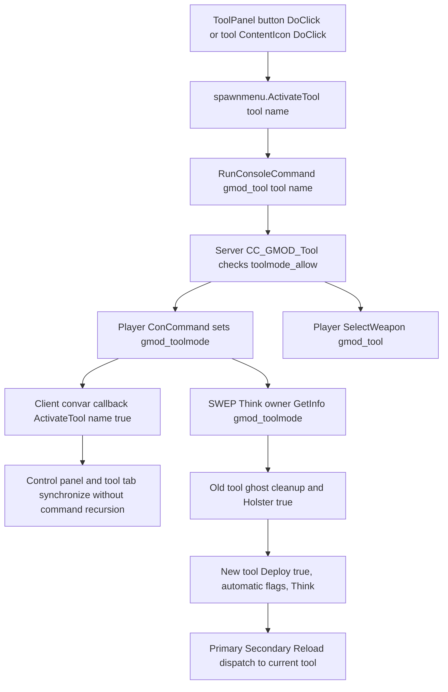

# Original GMOD Tool Gun architecture — 2026-10-07

Status: source-grounded investigation and support preparation. No runtime integration, deployment or game mutation was performed. Native implementation was not analysed in this slice; no IDA-derived addresses are claimed. Existing Opus ownership is preserved.

## Authority and evidence

The authoritative game root inspected through Desktop Commander is `C:\Program Files (x86)\Steam\steamapps\common\GarrysMod`. Paths below are relative to its `garrysmod` directory unless stated otherwise. The installed Lua files were read directly, not obtained from an upstream repository or substituted by a current online version. Canonical project policy and the 2026-10-06 Opus handoff were read before investigation.

Primary files read in full:

- `gamemodes/sandbox/entities/weapons/gmod_tool/{init.lua,shared.lua,cl_init.lua,stool.lua,stool_cl.lua,object.lua,ghostentity.lua,cl_viewscreen.lua}`.
- `gamemodes/sandbox/entities/weapons/gmod_tool/stools/{remover.lua,duplicator.lua,camera.lua,weld.lua,rope.lua}` and `stools/duplicator/{transport.lua,arming.lua,icon.lua}`.
- `lua/includes/modules/spawnmenu.lua`; `gamemodes/sandbox/gamemode/spawnmenu/toolpanel.lua`; `gamemodes/sandbox/gamemode/player_extension.lua`.
- `gamemodes/sandbox/entities/weapons/gmod_camera.lua`; `gamemodes/sandbox/entities/entities/gmod_cameraprop.lua`.
- `gamemodes/sandbox/entities/effects/{selection_indicator.lua,selection_ring.lua,entity_remove.lua}`.

The relevant `CanTool` policy in `gamemodes/sandbox/gamemode/shared.lua` and `lua/includes/modules/duplicator.lua` were read, including save/load data, registries, constrained-graph traversal, copy/paste and modifiers. A subsequent local cache read closed its final `DoGeneric → EntitySaver.Load` tail and inspected `spawnmenu/controlpanel.lua`.

Confidence is high for explicit script flow, medium for required host interfaces, and unresolved for native implementation and runtime parity. Exact hashes and actual staging destinations belong to the session provenance manifest; earlier inventory hashes below are historical evidence until revalidated. Analysis notes are safe to commit; original Lua/assets stay local.

## Reconciliation with previous preparation

Existing local preparation is under `build/prepared/gmod_qmenu_source_inventory/`, `gmod_tool_physgun_assets/`, `gmod_tool_physgun_asset_handoff/`, `gmod_hl_weapon_models/` and weapon/runtime handoffs. The first inventory reports 105 relevant Lua files, 40 stool files, 46 VGUI classes and 29/29 directly resolved UI references. That is inventory coverage, not proof of execution or full transitive closure.

Exact registry-count correction from the complete cached stool tree: 40 recursively inventoried files comprise 37 top-level mode files plus three Duplicator helpers (`transport.lua`, `arming.lua`, `icon.lua`). The loader scans only top-level `stools/*.lua`: 37 candidate modes, of which 33 are menu-visible by declared `AddToMenu` state before hook/allow policy. `creator`, `editentity`, `example` and `leafblower` declare `AddToMenu=false`. The companion manifest maps all 37 names/categories/convars/static constraint/entity calls, without claiming full behavioral analysis for every mode.

Both `gmod_tool_physgun_assets/` and `gmod_tool_physgun_asset_handoff/` currently list only a manifest at depth 2. Therefore the wording "staged assets" in prior readiness notes must be reconciled with concrete payload locations elsewhere; these particular directories themselves do not prove that payloads were copied there. The later asset handoff records hashes for 33 of 36 requested resources; its missing triplet concerns the Physgun view model, not Toolgun.

Local `context/HANDOFFS/ASTRA_TOOLGUN.md` exists and was recovered/read: it is a 14-line preparation handoff, not the detailed source trace sometimes implied by its name. The canonical 2026-10-06 overlay audit reported that this path was absent from GitHub. The current report supplies durable authored analysis without committing local proprietary source.

Earlier manifest fingerprints for two primary original scripts are `shared.lua`: `BDD3127030C651127A02F7E208EE0B953A7A374EBA10ACBCC8B6522EF47DA1C3` (9,768 bytes), `stool.lua`: `6CCED8F5FD1109FDA23B6AE0D89325831C7D5F2D9469CF8DD447FA0677A30FB3` (6,583 bytes). A child remote process attempt to rehash the complete slice hung and was cancelled; these values must not be represented as newly recalculated by this investigator. Root-owned staging performs current hash validation.

The root supplied an ignored local evidence cache for read/search acceleration. Its CRLF→LF normalization changes byte hashes (`shared.lua` 9,378 bytes; `stool.lua` 6,304 bytes), while preserving line numbering. The seed manifest labels these as `local_evidence_cache_sha256`, separately from original source SHA-256. Exact provenance must use the Windows staging/original hash, never the text-transfer cache hash.

### Source navigation anchors

| Relative source | Symbol / line |
|---|---|
| `gmod_tool/init.lua` | `CC_GMOD_Tool` 22 |
| `gmod_tool/stool.lua` | `ToolObj:CreateConVars` 33; filename registry 144; `PopulateToolMenu` 179 |
| `gmod_tool/shared.lua` | `InitializeTools` 37; `Think` 121; `DoShootEffect` 178; `DoToolTrace` 209; `PrimaryAttack` 233; `SecondaryAttack` 256; `Reload` 279; `Holster` 307; `GetToolObject` 364 |
| `gmod_tool/cl_init.lua` | convar change callback 6; `DrawHUD` 50; `FreezeMovement` 209 |
| `gmod_tool/cl_viewscreen.lua` | `RenderScreen` 45 |
| `lua/includes/modules/spawnmenu.lua` | `ActivateTool` 101; `AddToolMenuOption` 147 |
| `sandbox/gamemode/spawnmenu/toolpanel.lua` | `AddCategory` 234; `SetActiveToolText` 284; `SetActive` 302 |
| `gmod_tool/stools/remover.lua` | removal helper 11; `LeftClick` 42; `RightClick` 61; `Reload` 90 |
| `gmod_tool/stools/duplicator.lua` | paste positioning 71; `LeftClick` 89; `RightClick` 152; preview hook 334 |
| `lua/includes/modules/duplicator.lua` | `RegisterConstraint` 371; `RegisterEntityClass` 385; `Copy` 619; `CreateEntityFromTable` 668; `CreateConstraintFromTable` 726; `Paste` 797; constrained traversal 949 |
| `gmod_tool/stools/camera.lua` | `MakeCamera` 37; `LeftClick` 84; `RightClick` 109 |

Abbreviated `gmod_tool/` paths in this table resolve beneath `gamemodes/sandbox/entities/weapons/`; `sandbox/` resolves beneath `gamemodes/`.

## Complete Q-menu → selected tool → Tool Gun slice

`stool.lua` registers `PopulateToolMenu` / `AddSToolsToMenu`. Every registered stool whose `AddToMenu` is not false becomes a `spawnmenu.AddToolMenuOption`. The defaults are tab `Main`, category `New Category`, tool key as item name, name or translated key as label, command `gmod_tool <key>`, config name key and the stool's original `BuildCPanel` function. Custom `Tab`, `Category`, `Command`, `ConfigName` and `BuildCPanel` values must survive the bridge; the registry is not a fixed menu of hardcoded numeric actions.

`ToolPanel:AddCategory` in `toolpanel.lua` creates category buttons, sorts translated names, assigns each button its original `ItemName` and command metadata, and installs `item.DoClick → spawnmenu.ActivateTool(button.Name)`. Right-click opens a Derma menu to copy the name. Its disabled state is refreshed approximately every 1.5 seconds using `toolmode_allow_<name>` and a `CanTool` hook with button value 4. It remembers category expansion during search and restores it when filtering ends. Tool selection is a click operation in this inspected implementation. Hover does not arm or change the active tool in either this panel or the tool ContentIcon path.

`spawnmenu.ActivateTool(strName,noCommand)` searches the tab/category/item registry for `ItemName`. Unless `noCommand`, it splits and runs the registered command. It obtains `controlpanel.Get(strName)`, fills it via the stool callback only if not initialized, activates its panel/tab, and updates the selected button. `SetActive` hides existing control panels and shows/docks the selected panel; `SetActiveToolText` unselects all then selects the matching button. The client callback does not fabricate another weapon selector.

The original `controlpanel.lua` is explicitly a layer over Derma `DForm`; it includes `controls/manifest.lua`. `FillViaTable` marks initialization, sets panel name and calls the stool's `ControlPanelBuildFunction`. `ToolPresets` instantiates `ControlPresets` and registers the original default convar set; `KeyBinder` uses `CtrlNumPad`; `RopeSelect` uses `RopeMaterial`; `ColorPicker` uses `CtrlColor`; model/material pickers use `PropSelect` / `MatSelect`. These control dependencies and `DForm` inheritance belong in the panel closure; a tool-name button alone does not implement original configuration behavior.

`gmod_tool/init.lua` defines the server concommand `gmod_tool`. It rejects absent mode and any mode whose allow cvar is not 1, sends `gmod_toolmode <mode>` to the player, and selects weapon `gmod_tool`. `cl_init.lua` creates archived client userinfo convar `gmod_toolmode` with original default `rope`; its change callback invokes `spawnmenu.ActivateTool(new,true)`. The true flag is necessary: synchronizing the UI must not resend the original command in a loop.

`shared.lua` then reads `owner:GetInfo("gmod_toolmode")` in `SWEP:Think`, sets `Mode`, resolves its per-instance tool object, validates selected objects, and compares `current_mode`. If a previously active mode changes, the old tool releases ghosts and receives `Holster(true)`; the new tool receives `Deploy(true)`. The selected tool's `LeftClickAutomatic` and `RightClickAutomatic` control weapon automatic flags before `tool:Think()`. If the new tool is disallowed, old-tool cleanup still runs and action stops. There is no Fallout dialog or hand-authored selector anywhere in this chain. "Immediately" is an event/frame-level command/userinfo update, not a proven zero-latency update in the same instruction.

The tool content search provider matches both tool key and translated nice name, excludes `AddToMenu == false`, and creates `ContentIcon` type `tool`. Its `DoClick` calls `ActivateTool`, then `surface.PlaySound("ui/buttonclickrelease.wav")`; its material is `gui/tool.png`. It preserves the generic spawnmenu right-click context menu.

## Registry, instances and lifecycle

`shared.lua` initializes `SWEP.Tool`; its final include is `stool.lua`. `stool.lua` creates `ToolObj`, includes original ghost/object helpers and client helpers, scans `SWEP.Folder .. "/stools/*.lua"` through the Source `LUA` filesystem, lowercases each filename's tool key to preserve client/server agreement, creates a base object, includes the stool, creates its convars, and invokes `PreRegisterTOOL`. Only a hook result of false prevents insertion into `SWEP.Tool`. Files in the nested duplicator directory are includes of `duplicator.lua`, not additional stool registry names.

`ToolObj:Create` initializes mode/owner/weapon, client/server convar dictionaries, selected objects, stage 0 and help-message state. Default click handlers return false; default reload clears objects; deploy/holster/think release ghosts. `InitializeTools` copies each registered tool into a per-weapon instance, binds `SWEP`, `Owner`, `Weapon`, and calls `Init`. This matters for independent state and for restore: `OnRestore` rebuilds these instances. `Initialize` also creates separate Primary/Secondary tables so one weapon's automatic flags cannot mutate another weapon's shared defaults.

`CreateConVars` creates replicated/notify `toolmode_allow_<mode>` and archived client userinfo `<mode>_<property>` values; server properties get archived server convars. `GetClientInfo`, `GetClientNumber`, and `GetClientBool` obtain authoritative userinfo on the server and local convars on the client. A host implementation must preserve types, defaults, ownership and update semantics, rather than reading every value from one untyped global field.

`SetupDataTables` defines `TargetEntity1` through `TargetEntity4`. `object.lua` separately uses networked integers `Stage` and `Op`; server setters and client readers synchronize the help/prediction state. Selected objects store entity, physics object, physics bone, local hit position and local endpoint used to derive normals. Worldspawn is a special case stored in world space. Physics-local positions survive entity motion and ragdoll bone motion. `ClearObjects` releases ghosts, empties selected objects and zeros both stage and operation.

Holster queries the stool and falls back to SWEP `CanHolster`; on permitted client holster it records `FrameNumber` to suppress one extra multiplayer Think call, then deletes ghosts. Remove, owner change and deploy also respect tool cleanup/update data. These lifecycle guards are original correctness requirements, not optional visual polish.

## Input, trace, permission and prediction

`PrimaryAttack → DoToolTrace → current ToolObj → CheckObjects → Allowed → gamemode.Call("CanTool",owner,trace,mode,tool,1) → LeftClick(trace) → DoShootEffect`. Secondary follows the same route with button 2 / `RightClick`; reload accepts only `owner:KeyPressed(IN_RELOAD)`, then button 3 / `Reload`. Therefore reload is edge-triggered action on the current tool; its original meaning is not "open a mode selector".

`DoToolTrace` builds `util.GetPlayerTrace(owner)`, uses the bit mask `CONTENTS_SOLID|MOVEABLE|MONSTER|WINDOW|DEBRIS|GRATE|AUX`, zero min/max extents, and a filter containing owner and owner's vehicle. It first calls `util.TraceLine`; on no hit or invalid entity it attempts `util.TraceHull` and marks a successful entity fallback `HullTrace=true`. No hit aborts. Required result fields include `Hit`, `Entity`, `HitPos`, `HitNormal`, `PhysicsBone` and `StartPos` (camera uses it). The exact range is supplied by `util.GetPlayerTrace`, not a distance invented inside this SWEP.

`GM:CanTool` in Sandbox shared policy rejects physprop on jeep/APC, enforces each entity's `m_tblToolsAllowed`, lets `Entity:CanTool` decide when present, otherwise returns true. Original convar checks and permission hook results must occur before mutating world state. Their platform equivalent may protect FNV quest-owned/static/actor references, but compatibility policy must be stated separately from the original defaults.

Several stools immediately return a predicted client success while only the server performs world mutation. `DoShootEffect` plays the event and weapon/player animations, then gates selection/tracer effects by `bFirstTimePredicted` and `gmod_drawtooleffects`. A single-player FNV dispatcher can collapse client/server transport, but must preserve one authoritative mutation and avoid replaying effects or input actions. It must not run client and server stool branches both as independent world operations.

The installed source assigns `self.RequiresTraceHit = tool.RequiresTraceHit or true`; this literal assignment does not preserve false values, and the three attack functions independently require `DoToolTrace` success. Record this version-specific fact instead of silently "fixing" the source during investigation.

## View/world presentation, screen and feedback

The original SWEP declares `models/weapons/c_toolgun.mdl`, `models/weapons/w_toolgun.mdl`, `UseHands=true`, hold type `revolver`, no ammo, nonautomatic primary/secondary defaults, event `Toolgun.Single`, view animation `ACT_VM_PRIMARYATTACK` and player animation `PLAYER_ATTACK1`. `FireAnimationEvent` suppresses events 21 and 5003 to avoid model muzzle flashes. Model conversion must retain the original sequences, attachments and screen surface, while the adapter handles FNV skeleton/hand attachment, inventory form and first/third-person lifecycle.

`cl_viewscreen.lua` obtains material `models/weapons/v_toolgun/screen`, background `models/weapons/v_toolgun/screen_bg`, and a 256×256 render target `GModToolgunScreen`. `RenderScreen` binds it as `$basetexture`, pushes the target, starts 2D, draws the original background, then calls stool `DrawToolScreen` if available. Otherwise it draws translated current-tool text with font `GModToolScreen` (Helvetica, 60, weight 900), scrolling at `RealTime()*250`, including shadows and 64-pixel gap. This is a dynamic material surface, not a static image with a tool name stamped onto a replacement model. The native dispatch that invokes `RenderScreen` was not independently traced here.

`cl_init.lua` creates `GModToolName` (Roboto Bk, size 80, weight 1000), `GModToolSubtitle` (24), and `GModToolHelp` (17), all extended glyphs. It uses `vgui/gmod_tool`, `gui/gradient`, `gui/info`, and contextual `gui/{lmb.png,rmb.png,r.png,e.png}`. `DrawHUD` calls the stool's custom DrawHUD, then (if `gmod_drawhelp`) shows translated `#tool.<mode>.name`, description and stage/operation-filtered Information rows. Default help is `#tool.<mode>.<stage>`. `LastMessage` drives highlight fade. The source can suppress help when in a vehicle without weapon permission. Required font files must be resolved from the installed resources; platform fallback is not proof of font fidelity.

`DoShootEffect` supplies exact hit origin/normal/entity/physics bone to `selection_indicator` and weapon attachment 1/start shoot position/hit origin to `ToolTracer`. The inspected Lua `selection_indicator.lua` attaches to the entity physics bone, draws `effects/select_dot`, and emits six `selection_ring` effects. Rings use `effects/select_ring`, random speed 0.5–1.5, expanding size and frame-time alpha decay, with original blue-tinted random colors. ToolTracer is not a loose file in inspected `lua/effects` (directory absent) or Sandbox effects; its invocation and original `effects/tool_tracer` material are established, but native/packaged effect implementation remains unresolved for this slice.

Previous local manifest locates `Toolgun.Single` in VPK `scripts/sounds/lua.txt`, SHA256 `E89DF9CB57ED79F2E8133120C67ADDA3716A07B6FFC39161ED356D97AA510D33`; its old `waves: []` entry does not demonstrate payload closure. Use the later sound handoff and fresh extraction to resolve the exact event block and wave payload(s). No Fallout replacement sound is sanctioned.

## Remover

`remover.lua` is Construction category. Left click calls `DoRemoveEntity`, rejecting invalid entities and players. The client reports success; the server removes all constraints, marks entity non-solid, immobile and invisible, dispatches `entity_remove`, then deletes it after one second if still valid. Achievement updates go through player SendLua. Right click traverses `constraint.GetAllConstrainedEntities` and removes the entire connected set; reload removes only constraints. It does not mean "delete one FNV reference" in all three modes.

`entity_remove.lua` uses the original AABB/radius-derived particle count (clamped 32–256), `effects/spark`, outward velocity, 0.5–1.0-second lifetime, gravity, collision and bounce. The one-second deletion delay preserves the effect's source identity while preventing interactions. Adapter removal must invalidate bridge handles safely and preserve constraint/undo registries. Player immunity is original evidence; project actor/quest policy is adaptation, not an excuse to apply the action to PlayerCharacter.

## Duplicator

`duplicator.lua` includes transport, arming and icon helpers, registers cleanup `duplicates`, and uses original `duplicator` module. Right click sets a temporary local origin at trace hit and local yaw at player eye yaw, calls `duplicator.Copy`, resets local origin/angle, stores the full graph as `owner.CurrentDupe`, and sends metadata `CopiedDupe`. Copied state belongs to the player so it survives weapon replacement/death/respawn; it is not a single base-form pointer.

Left click uses current dupe, zeroes eye pitch/roll, adjusts paste center for ceiling/ground and collision extents, applies additional horizontal trace corrections, sets local transform, calls `duplicator.Paste`, resets the local transform, and creates one grouped undo/cleanup transaction for all returned entities. The client only predicts when it has `CurrentDupeName`. Preview is an original `PostDrawTranslucentRenderables` hook gated to active `gmod_tool` mode `duplicator`; it draws depth-tested/overlaid wireframe bounds, not an independently invented spawn widget.

The native-independent Lua module saves entities and physics objects relative to the dupe origin: class/model/transform/skin/bodygroups, health, collision group/bounds, scale, materials/colors/submaterials, persistent state, network variables, physics bones with frozen/gravity state, modifiers and callbacks. It traverses allowed entities and constraints, excludes `DoNotDuplicate`, and special-cases worldspawn. `RegisterEntityClass` and `RegisterConstraint` hold factories. `Paste` copies input tables, creates all entities through registered/generic factories, restores network data/callbacks, applies modifiers, then creates constraints through remapped entity/bone/local-anchor IDs. Preserve this data model and construction order.

`CopiedDupe` carries save permission, mins/maxs, name, entity/constraint counts and Workshop dependencies, and rebuilds the original control panel. `dupe_save` compresses JSON and chunks `ReceiveDupe` in 60,000-byte parts; `dupe_arm` reads `engine.OpenDupe`, validates bounded decompression/table/constraint/entity/bounds data, sends `ArmDupe`, stores armed state and selects `gmod_tool duplicator`. `icon.lua` consumes `g_ClientSaveDupe` on PostRender, creates client models/ragdolls, renders 512×512 original background/outline/lighting, captures JPEG, determines required addons and calls `engine.WriteDupe`. The outline has an original <800-entity safety gate. Engine dupe-container IO and compression compatibility remain native/format boundaries requiring evidence, not arbitrary replacement files.

Native Steam Workshop calls are optional only for a deliberately declared offline/local feature scope. Their status/dependency semantics are part of the original UI; absent host support must be recorded rather than represented as completed. Full duplication also requires the entity factory registration used by curated prop classes, constraint library, modifiers, undo and cleanup.

## Two distinct camera systems

The Toolgun stool `stools/camera.lua` belongs to Render category and creates `gmod_cameraprop`; it is not the screenshot Camera weapon. Its convars are `camera_locked=0`, `camera_key=37`, `camera_toggle=1`. Left click creates a camera at `trace.StartPos` with player's eye angle, updates the camera associated with that player's control key, registers cleanup/count/undo, and uses numpad assignments. Right click creates a tracking camera; world hits track the owner, player hits normalize to player origin, and other entities use local hit positions. Camera entity model is `models/dav0r/camera.mdl`, with original network variables for key/on/tracking/player. It toggles `Player:SetViewEntity`, supports held-key On/Off, follows tracked local points with player view offset, prevents tooling on locked cameras and cleans up view ownership on removal.

`gamemodes/sandbox/entities/weapons/gmod_camera.lua` is a separate SWEP: view model `models/weapons/c_arms_animations.mdl`, world model `models/MaxOfS2D/camera.mdl`, event `NPC_CScanner.TakePhoto`. Primary invokes Source `jpeg`, with prediction/single-player branching; secondary mouse movement controls zoom/roll from CUserCmd; reload resets zoom/roll; `FreezeMovement`, `TranslateFOV`, `CalcView`, sensitivity and HUD hooks implement camera control. Its native screenshot implementation and Tick caller remain untraced here. Do not use that weapon's screenshot behavior as the implementation of the camera stool.

## Constraint examples and scope

`weld.lua` demonstrates why a numeric Toolgun action switch cannot reproduce the registry. Left-click is a two-object operation; right-click goes through ghost/align/freeze, surface-normal rotation and final constraint construction, using networked stage/op. It stores physics-bone-local points, excludes players, uses `constraint.Weld`, groups undo and tracks cleanup/counts. `Think` applies `GetCurrentCommand():GetMouseX()*0.05` rotation in its placement stage; `FreezeMovement` prevents camera movement while rotating; holster clears objects; reload removes Weld constraints.

`rope.lua` is original default selected mode. It preserves forcelimit/addlength/material/width/rigidity/color convars, two-point local anchors and physics bones; invokes `constraint.Rope`; groups both physics constraint and rendered rope in undo/cleanup; right click retains the last endpoint to continue a chain; reload removes Rope constraints. Its control panel uses ToolPresets, sliders, RopeSelect and ColorPicker. Additional target tools are inventoried in the 37-mode/40-file tree but were not all behaviourally traced in this report; do not promote their behaviour to parity merely from inventory presence.

## Smallest FNV compatibility boundary

| Original responsibility | Required adapter | Evidence/status |
|---|---|---|
| Tool registry, selection, lifecycle and stool callbacks | GMod-compatible Lua environment, original include/registry/hook/convar APIs; dispatcher receives string mode | Script flow traced; FNV execution unimplemented/unverified |
| Client command → server/userinfo → weapon switch | Single authoritative command dispatcher, convar state and inventory/equipped-weapon mapping; update UI with noCommand | Do not retain hover numeric-index selection as final contract |
| Source entity/physics bone/local coordinates | Stable bridge entity handles → FNV references; Havok object/bone lookup; explicit coordinate/unit conversion | Preserve worldspawn and invalidation semantics |
| Source trace line/hull | FNV world/actor/reference trace returning original fields and owner/vehicle filtering | Native implementation/accuracy and GetPlayerTrace range need verification |
| Constraints, duplication, undo/cleanup | Constraint graph/Havok factories, entity factories, grouped reversible transactions and persistent copied state | Full graph semantics required; single-form clone is incomplete |
| VGUI/Derma/controlpanel | Rendering, focus, panel, layout and original control callbacks; curated content adapter | No Fallout prompts or recreated fixed-grid UI |
| Toolgun RT screen/HUD/effects | Surface/cam/render compatibility, model attachments, material RT binding, particles/tracer and language/font resources | Native RenderScreen/ToolTracer dispatch unresolved |
| Source animation/sound | Original source models/QC/sequences/events → validated FNV skeleton/audio/material backend | Existing model/hash preparation; held/view conversion not parity proof |
| Prediction/net variables | Local deterministic event state, one mutation/effect per input, stage/op/dupe metadata synchronization | Transport can be adapted while branch semantics survive |
| Camera entity/weapon | Host view-entity/FOV/roll/numpad/screenshot backend with clean restore | Distinct systems preserved; native screenshot not traced |

No transplanted arbitrary binary region is necessary to preserve the Lua-facing Toolgun state machine. Native investigation should target clean boundaries: trace/physics methods, Lua API bindings, effect dispatch, material/render targets and dupe-container IO. Use IDA Pro 6.8 only and record build hashes before treating any address as portable.

## Comparison to inspected project implementation

Root-owned current audit reports the existing overlay as custom GDI fixed-grid UI, selected tool held in `UInt32 g_selectedGModToolIndex`, hover commits for Duplicator/Remover (indices 7/29), and R while Toolgun-equipped reopening the menu as selector. These implementation observations are cross-agent findings, not this investigator's own native execution test. The original files above establish direct discrepancies:

- Original click selection uses stable stool keys, registered command dispatch, allow checks, userinfo update and immediate weapon selection; hover arming numeric indices omits those semantics and can switch tools merely by moving the mouse.
- Original reload is an edge-triggered stool callback and can remove constraints/clear stages; R-as-selector competes with genuine tool behavior.
- Duplicator is constrained-graph serialization/paste and Remover has three distinct actions; existing callbacks should be retained as provisional bridge boundaries only where validated, not claimed as full original behavior.
- Dynamic screen, source animations/effects and per-tool stage/operation HUD cannot be satisfied by a Fallout notification box or static replacement texture.

No existing runtime component was replaced. The appropriate eventual repair is to keep validated FNV entity/input/render/inventory adapters, while feeding them preserved source callbacks and data after a real GMod UI hosting boundary exists. Root audit owns precise current project paths/hashes and runtime risk classifications.

## Staging seeds and unresolved work

Machine-readable companion: `manifests/gmod_2026-10-07/toolgun_dependency_seeds.json`. It separates files observed directly, prior-manifest resources and unresolved native/asset boundaries. Copy only explicit closure resources into existing staging, hash originals and destinations, preserve VPK internal paths, and reuse matching staged hashes. This investigator staged no proprietary payload and makes no claim that seed presence equals payload extraction.

Remaining work: resolve exact current Toolgun sound event wave closure; complete font/material texture closure; verify ToolTracer native/package implementation and screen rendering caller; trace `util.GetPlayerTrace` range and underlying trace binding; verify original SWEP base/native prediction/input interfaces; close every supported stool's transitive entity/constraint/control-panel dependencies; prove converted view/world animations and screen attachment; implement/playtest the Q-state callback boundary; validate FNV constraints/ragdolls, save/load and cleanup. These are explicitly unresolved, not permission to recreate missing assets or replace original behavior.
